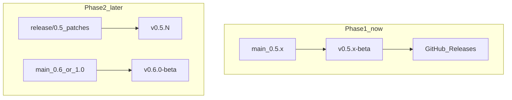

# Deployment and versioning

Operator playbook for VectorTrack: how to develop locally, when to rebuild the installer, how to commit, and how to publish a beta for testers. Build commands and repo layout are in [`DEVELOPMENT.md`](DEVELOPMENT.md).

Beta testers should use the [repository README](../README.md) and [GitHub Releases](https://github.com/Paragonlivedesign/VectorTrack/releases/latest) — not raw files on `main`.

---

## Three environments

| Environment | How you run it | When | User data |
|-------------|----------------|------|-----------|
| **Local dev** | [`VectorTrack 0.5/dev.ps1`](../VectorTrack%200.5/dev.ps1) | Every code change; restart the app, no reinstall | `%LOCALAPPDATA%\Paragon\VectorTrack\` (same as installed, unless `--portable`) |
| **Local installer smoke test** | `.\build.ps1 -WithInstaller`, then run `dist\installer\VectorTrack-X.Y.Z-Setup.exe` | Before tagging a beta; verify Program Files install | Same AppData |
| **Public beta** | GitHub Release assets (installer + plugin zip) | When testers should update | Testers' machines |

**Rule:** Day-to-day coding = **`dev.ps1` only**. Rebuild the installer and create a GitHub Release **when publishing to testers**, not on every commit.

Quit the installed app (system tray) before running `dev.ps1` — only one instance can run at a time.

---

## Semantic versioning (SemVer)

VectorTrack follows [Semantic Versioning](https://semver.org/): **`MAJOR.MINOR.PATCH`** (three numbers).

| Part | Name | When to bump | Examples |
|------|------|--------------|----------|
| **First** | **MAJOR** | Breaking changes, big milestones, new product era | `0.x` → **`1.0.0`** when leaving beta; later **`2.0.0`** if you break data or compatibility |
| **Second** | **MINOR** | New features, backward compatible | **`0.5.0` → `0.6.0`** for a notable feature wave on the beta line |
| **Third** | **PATCH** | Bug fixes only, no new features | **`0.5.0` → `0.5.1`** (AppData path fixes), **`0.5.2`** (next hotfix) |

**Pre-1.0 beta:** **`0.5.0`** means “product line 0.5, first release on that line.” Patch bumps (`0.5.1`, `0.5.2`) are normal while stabilizing. **`1.0.0`** is the usual “out of beta” signal.

### App version vs Git tag vs Release title

| Concept | Example | Purpose |
|---------|---------|---------|
| App version (Help → About) | `0.5.1` | What users see |
| Git tag | `v0.5.1-beta` | Points GitHub Releases at a commit (keep `-beta` until `1.0.0`) |
| Release title | `VectorTrack 0.5.1 beta` | Human-readable on GitHub |

Testers install **only tagged Releases**, not whatever is on `main` at the moment.

### When to bump which number

```
Fix only (no new features)?
  └─ PATCH: 0.5.0 → 0.5.1

New features, same beta line, backward compatible?
  └─ MINOR: 0.5.x → 0.6.0  (or stay on 0.5.x during heavy beta if you prefer)

Leaving beta or breaking compatibility?
  └─ MAJOR: → 1.0.0 (or 2.0.0 later)
```

**Folder names** (`VectorTrack 0.5/`, `VectorTrackScript 0.5/`) are **product-line labels**, not semver. Rename folders only on a major product-line change (as when moving from v4 to 0.5). Do not rename folders for every patch.

Version history: [`VectorTrack 0.5/CHANGELOG.md`](../VectorTrack%200.5/CHANGELOG.md)

---

## Branches

### Phase 1 — Now (0.5 beta)

- **`main`** — all feature work and fixes for the 0.5 line
- **`archive`** — frozen legacy prototypes (do not develop here)
- **Deploy** — tag `v0.5.x-beta` on `main` when testers should get a build
- Long-lived feature branches are optional (use for large or risky changes)

### Phase 2 — When 0.5 is stable enough

- Create **`release/0.5`** from the last good `v0.5.x-beta` tag
- **`release/0.5`** — patch-only fixes (`0.5.3`, `0.5.4`) for testers still on 0.5
- **`main`** — bump to **`0.6.0`** (or work toward **`1.0.0`**) for the next feature wave
- Optional: tag **`v0.5.N`** without `-beta` when you declare that line done

### Phase 3 — Post-1.0 (future)

- **`main`** — next minor/major development
- **`release/X.Y`** — optional short-lived branches only if you must hotfix an old version in the field



---

## Version bump checklist

When publishing a **new version number** (not every commit), update these files together:

| File | What to change |
|------|----------------|
| [`VectorTrack 0.5/vectortrack/config.py`](../VectorTrack%200.5/vectortrack/config.py) | `APP_VERSION` (source of truth; [`__init__.py`](../VectorTrack%200.5/vectortrack/__init__.py) reads it) |
| [`VectorTrack 0.5/installer.iss`](../VectorTrack%200.5/installer.iss) | `AppVersion`, `OutputBaseFilename` (e.g. `VectorTrack-0.5.1-Setup`) |
| [`VectorTrackScript 0.5/vectortrackscript_main.py`](../VectorTrackScript%200.5/vectortrackscript_main.py) | `PLUGIN_VERSION` |
| [`VectorTrack 0.5/CHANGELOG.md`](../VectorTrack%200.5/CHANGELOG.md) | New section for this release |
| README version badges | Optional — root and sub-READMEs |

Skip version bumps for WIP commits that are not going to testers yet.

---

## Standard release workflow

Use this order when shipping a beta to testers:

1. **Finish features** on `main` (merge or commit locally).
2. **Run tests**
   ```powershell
   cd "VectorTrack 0.5"
   $env:PYTEST_DISABLE_PLUGIN_AUTOLOAD=1
   .\.venv\Scripts\python -m pytest tests\ -q
   ```
3. **Run from source** — quit installed VectorTrack, then:
   ```powershell
   cd "VectorTrack 0.5"
   .\dev.ps1
   ```
4. **Update CHANGELOG** and **version strings** (if this release gets a new number) — see checklist above.
5. **Commit and push** source to `main`. Do **not** commit `release/`, `dist/`, or `.venv/` (gitignored).
6. **Build artifacts**
   ```powershell
   cd "VectorTrack 0.5"
   .\build.ps1 -WithInstaller

   cd "..\VectorTrackScript 0.5"
   .\package_plugin.ps1
   ```
7. **Smoke-test the installer** — run `VectorTrack 0.5\dist\installer\VectorTrack-X.Y.Z-Setup.exe`, launch from Start Menu, check **Help → About**, confirm app starts (logs/reports under AppData).
8. **Publish GitHub Release**
   - **Releases → Draft new release**
   - Tag: `vX.Y.Z-beta` (e.g. `v0.5.1-beta`)
   - Title: e.g. `VectorTrack 0.5.1 beta`
   - Release notes: copy the relevant section from CHANGELOG
   - Attach:
     - `VectorTrack-X.Y.Z-Setup.exe`
     - `VectorTrackScript_0.5.zip`
   - Publish

Testers reinstall from the new Release; uninstalling the old installer **keeps** user data in `%LOCALAPPDATA%\Paragon\VectorTrack\` unless they choose to remove it during uninstall.

### gh CLI (optional)

```powershell
gh release create v0.5.1-beta `
  "VectorTrack 0.5/dist/installer/VectorTrack-0.5.1-Setup.exe" `
  "VectorTrackScript 0.5/VectorTrackScript_0.5.zip" `
  --title "VectorTrack 0.5.1 beta" `
  --notes-file "VectorTrack 0.5/CHANGELOG.md"
```

Adjust tag, paths, and notes for each release.

---

## What not to commit

| Path | Reason |
|------|--------|
| `VectorTrack 0.5/release/` | Local PyInstaller output |
| `VectorTrack 0.5/dist/` | Installer build output |
| `VectorTrack 0.5/.venv/` | Local Python environment |
| `*.exe`, `*.zip` in build dirs | Published via GitHub Releases instead |

---

## Optional later

- **`bump-version.ps1`** — single command to update all version strings
- **GitHub Actions** — build and attach assets when a tag is pushed
- **`release/0.5` branch** — when stabilizing 0.5 separately from 0.6 work on `main`

---

## Related docs

- [`DEVELOPMENT.md`](DEVELOPMENT.md) — build commands, tests, repo layout, daily dev with `dev.ps1`
- [`VectorTrack 0.5/CHANGELOG.md`](../VectorTrack%200.5/CHANGELOG.md) — version history
