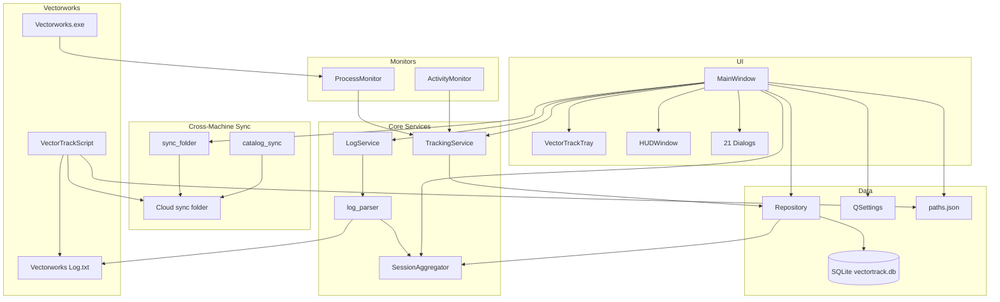
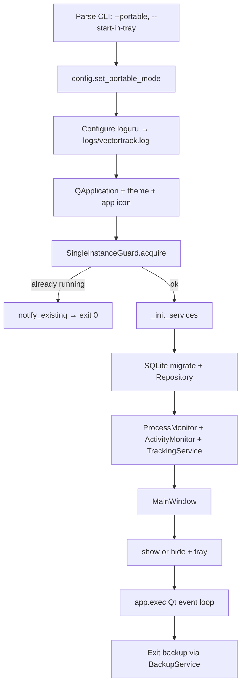

# VectorTrack — Technical Audit & Case Study

**Document purpose:** Full reverse-engineering of the VectorTrack codebase for planning a ground-up refactor.  
**Version audited:** 0.5.8 beta  
**Date:** June 25, 2026  
**Scope:** Entire repository — desktop app, Vectorworks plug-in, build pipeline, data layer, workflows, and technical debt.

---

## Table of Contents

1. [Executive Summary](#1-executive-summary)
2. [Product Overview](#2-product-overview)
3. [Repository Structure](#3-repository-structure)
4. [Technology Stack](#4-technology-stack)
5. [Architecture](#5-architecture)
6. [Application Lifecycle](#6-application-lifecycle)
7. [Data Layer](#7-data-layer)
8. [Feature Inventory](#8-feature-inventory)
9. [User Workflows](#9-user-workflows)
10. [State & Business Logic](#10-state--business-logic)
11. [Cross-Machine Sync](#11-cross-machine-sync)
12. [VectorTrackScript Plug-in](#12-vectortrackscript-plug-in)
13. [Build, Test & Release](#13-build-test--release)
14. [Test Coverage Map](#14-test-coverage-map)
15. [Technical Debt Analysis](#15-technical-debt-analysis)
16. [Current Workflow State](#16-current-workflow-state)
17. [Rebuild Recommendations](#17-rebuild-recommendations)

---

## 1. Executive Summary

VectorTrack is a **Windows-only Python desktop application** paired with an optional **Vectorworks menu plug-in**. It tracks billable time spent in Vectorworks CAD/BIM drawings — not GPS or geographic location. The product monitors open `.vwx` files, detects idle time, merges live tracking with Vectorworks log history, and produces billing reports.

### Key findings

| Area | Assessment |
|------|------------|
| **Architecture** | Layered Python monolith (UI → Services → DB). No Electron, no web backend, no microservices. |
| **Maturity** | Feature-rich beta (0.5.8). Core tracking, billing, sync, and reports are production-quality for invited testers. |
| **Strengths** | Solid service-layer tests, thoughtful sync folder design, good log parsing, clear domain models emerging in `SessionAggregator`. |
| **Critical debt** | `main_window.py` (~2,006 lines) is a god object; `repository.py` (~1,035 lines) is a fat repository; desktop and plug-in duplicate log/sync/config code with no shared package. |
| **Rebuild priority** | Extract `vectortrack-core` shared library first, then split MainWindow and Repository before rewriting UI. |

### Scale

| Metric | Value |
|--------|-------|
| Tracked source files | ~150 |
| Desktop Python modules | ~70 |
| Plug-in Python modules | ~8 |
| Desktop test modules | 31 (+ conftest) |
| Approx. test functions | ~160 |
| Largest file | `main_window.py` (2,006 lines) |
| SQLite schema version | 5 |

---

## 2. Product Overview

### Two independent products

| Product | Runs where | Primary value |
|---------|------------|---------------|
| **VectorTrack** | Windows desktop (background + system tray) | Automatic tracking of open Vectorworks files, idle detection, projects, sessions, PDF/CSV reports, cross-machine sync |
| **VectorTrackScript** | Inside Vectorworks (menu command) | Quick time summary for the currently open document — hours, rates, budget, copy-to-clipboard |

Neither product requires the other. They share concepts (log parsing, sync folder layout) but **do not share Python imports at runtime**.

### Target users

Design professionals using Vectorworks who need accurate, project-level time tracking for billing — with optional multi-machine log merging via a user-chosen cloud folder (Google Drive, Dropbox, OneDrive).

### What VectorTrack is NOT

- Not GPS / geolocation tracking
- Not a web app or SaaS (no server backend)
- Not an Electron app
- Not a real-time collaborative platform (sync is file-based, last-write-wins)

---

## 3. Repository Structure

```
VectorTrack/
├── README.md                          # User-facing install & download docs
├── .gitignore                         # Ignores .venv, release/, dist/, *.exe, *.db
├── docs/
│   ├── DEVELOPMENT.md                 # Dev workflow, tests, build
│   ├── DEPLOYMENT.md                  # Versioning, release checklist
│   ├── release-notes-v0.5.*-beta.md   # Per-release notes
│   └── TECHNICAL-AUDIT.md             # This document
├── VectorTrack 0.5/                   # Desktop app (PyQt6)
│   ├── run.py                         # PyInstaller entry point
│   ├── dev.ps1 / build.ps1            # Dev & production build scripts
│   ├── build.spec / installer.iss     # PyInstaller + Inno Setup configs
│   ├── requirements.txt / pytest.ini
│   ├── CHANGELOG.md / EULA.md / TODO.md
│   ├── assets/                        # App icon (vectortrack.ico)
│   ├── release/                       # Gitignored local build output
│   ├── tests/                         # 31 pytest modules
│   └── vectortrack/                   # Main Python package
│       ├── app.py                     # Bootstrap
│       ├── config.py                  # Version, paths, constants
│       ├── process_monitor.py         # Win32 window detection
│       ├── activity_monitor.py        # Idle detection (pynput)
│       ├── log_parser.py              # Vectorworks Log.txt parser
│       ├── sync_folder.py / sync_config.py
│       ├── db/                        # SQLite schema + repository
│       ├── models/                    # Domain dataclasses
│       ├── services/                  # 15+ business logic modules
│       └── ui/                        # PyQt6 UI + 21 dialogs
└── VectorTrackScript 0.5/             # Vectorworks plug-in
    ├── VSM_WRAPPER.py                 # Paste into Plug-in Manager
    ├── vectortrackscript_main.py      # Entry bridge
    ├── vectortrack_dialog.py          # Main dialog UI
    ├── vectortrack_log.py             # Log parser (duplicate of desktop)
    ├── vectortrack_sync.py            # Sync (duplicate of desktop)
    ├── vectortrack_config.py          # Config (duplicate of desktop)
    ├── vectortrack_rates.py           # Per-project rates (separate from SQLite)
    └── tests/                         # 2 pytest modules
```

**Branch model:**
- `main` — active 0.5.x development
- `archive` — frozen legacy prototypes (v4 and earlier)

**Naming note:** `VectorTrack 0.5/` is a product-line folder label, not semver. Version lives in `config.py` (`APP_VERSION = "0.5.8"`).

---

## 4. Technology Stack

| Layer | Technology |
|-------|------------|
| Language | Python 3.10+ |
| Desktop UI | PyQt6 (widgets, system tray, dialogs, single-instance IPC) |
| Database | SQLite (`vectortrack.db`), schema v5 |
| Windows integration | pywin32 (HWND/process enumeration), psutil, pynput (input/idle) |
| PDF reports | ReportLab |
| Logging | loguru (rotating file logs) |
| Licensing (dormant) | cryptography (Fernet) — `ENFORCE_LICENSING = False` |
| Testing | pytest, pytest-qt, pytest-mock, pytest-cov |
| Packaging | PyInstaller → portable `VectorTrack.exe` |
| Installer | Inno Setup 6 → `VectorTrack-0.5.8-Setup.exe` |
| Build automation | PowerShell (`dev.ps1`, `build.ps1`, `build_installer.ps1`, `deploy_beta.ps1`) |
| Vectorworks plug-in | Vectorworks Python API (`vs` module), `.vsm` menu command wrapper |

**Not present:** npm/Node.js, Electron, Docker, CI/CD (GitHub Actions), web frontend/backend, custom C/C++.

### Runtime dependencies (`requirements.txt`)

| Package | Purpose |
|---------|---------|
| PyQt6 | Entire desktop UI |
| pywin32 | ProcessMonitor — enumerate HWNDs, foreground window |
| psutil | Process metadata for Vectorworks executables |
| pynput | ActivityMonitor + HotkeyService |
| reportlab | PDF billing reports |
| loguru | Structured rotating app logs |
| cryptography | LicenseManager (disabled in beta) |
| python-dotenv | Listed but **never imported** in codebase |
| pytest* | Unit/integration tests |
| pyinstaller | Build-only (installed on demand by `build.ps1`) |

---

## 5. Architecture

### 5.1 Layered monolith pattern

```
┌─────────────────────────────────────────────────────────┐
│  UI Layer (PyQt6)                                       │
│  main_window, tables, dialogs, tray, HUD, theme         │
└───────────────────────┬─────────────────────────────────┘
                        │
┌───────────────────────▼─────────────────────────────────┐
│  Service Layer                                          │
│  tracking, billing, reports, sync, backup, hotkeys…     │
└───────────────────────┬─────────────────────────────────┘
                        │
┌───────────────────────▼─────────────────────────────────┐
│  Domain / Infrastructure                                │
│  process_monitor, activity_monitor, log_parser, budget  │
└───────────────────────┬─────────────────────────────────┘
                        │
┌───────────────────────▼─────────────────────────────────┐
│  Data Layer                                             │
│  Repository + schema migrations + models                │
└─────────────────────────────────────────────────────────┘
```

### 5.2 Component connection diagram



### 5.3 Process model

Single Python process — no Electron main/renderer split. UI and native monitoring share one process and background threads (idle detection, hotkey listeners).

### 5.4 Largest source files (lines)

| File | Lines | Role |
|------|------:|------|
| `ui/main_window.py` | 2,006 | Central hub — menus, timers, all feature wiring |
| `db/repository.py` | 1,035 | Full CRUD for all entities |
| `services/catalog_sync.py` | 912 | Catalog diff, merge, apply |
| `ui/dialogs/project_editor_dialog.py` | 645 | Project CRUD, aliases, budgets |
| `ui/dialogs/session_explorer_dialog.py` | 499 | Session browse/edit/conflicts |
| `services/session_aggregator.py` | 410 | Log + DB merge |
| `services/report_service.py` | 400 | PDF/CSV generation |
| `log_parser.py` | 362 | VW Log.txt parsing |
| `process_monitor.py` | 330 | Win32 window enumeration |
| `services/tracking_service.py` | 210 | Live tracking orchestration |

---

## 6. Application Lifecycle

### 6.1 Entry points

| Entry | Path | Used when |
|-------|------|-----------|
| Primary (dev) | `vectortrack/__main__.py` | `python -m vectortrack` |
| PyInstaller | `run.py` | Frozen `VectorTrack.exe` |
| Direct | `vectortrack/app.py` → `main()` | Importable bootstrap |

All paths converge on `vectortrack.app.main()`.

### 6.2 Startup sequence



**`_init_services()` (`app.py`):**
1. Opens SQLite, runs `migrate()` (schema v5, legacy v1 import)
2. Creates `Repository`, `ProcessMonitor`, `ActivityMonitor`, `TrackingService`
3. Creates `MainWindow` with `LogService`, `BillingService`
4. Writes `paths.json` via `config.write_paths_json()`

**`MainWindow.__init__` then:**
- Loads `QSettings("Paragon", "VectorTrack")` — 15+ preference keys
- Builds UI (dashboard, open files, project summary, History/Heatmap/Clients tabs)
- Starts `tracking_service.start()`, 1-second `QTimer` → `_tick()`
- Starts `HotkeyService`, `NotificationService`, system tray
- Deferred `_run_startup_sequence()`: first-run wizard, VW setup prompts, initial sync push

### 6.3 The 1 Hz tick loop (`MainWindow._tick`)

Every second:
1. `tracking_service.tick()` — poll VW windows, advance timers, autosave sessions
2. Refresh open-files table, project summary, HUD, tray icon
3. Every 60s: refresh history + optional log sync push

Every 30s (inside TrackingService): autosave open sessions to SQLite.

### 6.4 Shutdown

On exit: `BackupService.create_backup()` zips DB + `paths.json` + legacy JSON manifests (retention: 10 backups).

### 6.5 CLI flags

| Flag | Effect |
|------|--------|
| `--portable` | Store data in `./data/` next to executable |
| `--start-in-tray` | Launch hidden in system tray |

### 6.6 Single-instance behavior

`SingleInstanceGuard` uses `QLockFile` + `QLocalServer`. Second launch sends `b"raise"` to show existing window and exits.

---

## 7. Data Layer

### 7.1 Storage mechanisms

| Mechanism | Location | Purpose |
|-----------|----------|---------|
| **SQLite (primary)** | `%LOCALAPPDATA%\Paragon\VectorTrack\vectortrack.db` | Clients, projects, sessions, settings, audit |
| **Legacy SQLite** | `...\sessions.db` | One-time v1 import into main DB |
| **QSettings** | Windows registry `Paragon/VectorTrack` | UI prefs, sync config, window geometry |
| **paths.json** | Data dir | Path manifest for desktop + plug-in bridge |
| **Sync folder** | User-chosen cloud dir | Log snapshots, assignments, catalog |
| **Vectorworks Log.txt** | VW roaming data dir | Historical open/close sessions (read-only input) |
| **license.json + key.dat** | Data dir | Encrypted trial/license (disabled) |
| **Zip backups** | `...\backups\*.zip` | Exit/manual backup |
| **PDF/CSV reports** | `...\reports\` | Generated deliverables |
| **App logs** | `...\logs\vectortrack.log` | loguru rotation |
| **.vtpack** | User-selected path | Session import bundles |
| **rates.json** | Plug-in dir only | Per-project rates in VW plug-in |

**Portable mode:** `--portable` or hidden settings → data in `./data/` next to executable.

**Environment override:** `VECTORTRACK_DATA_DIR` overrides data directory path.

### 7.2 SQLite schema (v5)

**Files:** `vectortrack/db/schema.py`, `vectortrack/db/repository.py`

| Table | Key columns |
|-------|-------------|
| `clients` | `id`, `name` (UNIQUE), `code`, `is_active`, timestamps |
| `billable_projects` | `id`, `client_id` FK, `project_code` (UNIQUE), `name`, `hourly_rate`, `is_active`, `is_locked`, `locked_at`, `invoice_number` |
| `project_aliases` | `project_id` FK, `alias_pattern`, `is_regex`, `priority`, `is_active` |
| `sessions` | `project_id`, `file_path`, `file_alias`, `machine_id`, `source`, `start_time`, `end_time`, `hourly_rate`, `rate_overridden`, duration fields |
| `session_audit` | JSON `old_values`/`new_values` audit trail |
| `session_exclusions` | (v4) Exclude log sessions by `log_key` |
| `session_adjustments` | (v4) Manual time corrections |
| `log_sources` | Extra log file paths registered by user |
| `app_settings` | Key-value store — budgets, conflict resolutions, migration markers |
| `project_audit` | (v3) Lock/unlock audit |

**Unique index:** open sessions — `(project_id, file_path, machine_id, source) WHERE end_time IS NULL`

**Migration path:** v1 `sessions.db` → v5 unified schema with `source='legacy-v1'` marker.

### 7.3 Domain models

**Package:** `vectortrack/models/`

| Model | File | Persisted |
|-------|------|-----------|
| `TimeSession` | `session.py` | Yes (sessions table) |
| `Client`, `BillableProject`, `AliasRule` | `billable_project.py` | Yes |
| `TrackingState` | `services/tracking_service.py` | In-memory only |
| `UnifiedSession` | `services/session_aggregator.py` | Computed view |
| `SessionRecord` | `log_parser.py` | Parsed from log text |
| `BillingContext` / `BillingSummary` | `services/billing_service.py` | Pure calculation |
| `SyncConfig` | `sync_config.py` | QSettings + paths.json |
| `ProjectBudget` | `budget.py` | app_settings keys |

### 7.4 Repository API

`Repository` is the single abstraction over SQLite. Key write paths:

| Domain | Methods |
|--------|---------|
| Clients | `create_client`, `update_client` |
| Projects | `create_project`, `update_project`, `set_project_lock`, `delete_project` |
| Aliases | `upsert_alias_rule` |
| Live tracking | `start_session`, `update_session_duration`, `end_session`, `upsert_open_session`, `close_session` |
| Assignments | `assign_file_to_project`, `set_open_session_rate` |
| Manual | `add_manual_session`, `update_session`, `delete_session` |
| Overrides | `add_exclusion`, `add_adjustment`, `update_adjustment`, `delete_*` |
| Settings | `set_setting`, `get_setting` |
| Audit | `add_session_audit` |

**Rate resolution:** `resolve_hourly_rate()` → `db/rate_resolver.py` — project rate vs default.

### 7.5 QSettings keys (preferences)

| Key | Default | Meaning |
|-----|---------|---------|
| `default_hourly_rate` | 75.0 | Fallback billing rate |
| `default_idle_timeout` | 5 | Idle minutes |
| `idle_pause_enabled` | true | Pause on idle |
| `idle_bypass_mode` | `"none"` | `none`, `vw_foreground`, `vw_file_open`, `log_open` |
| `auto_track_enabled` | true | |
| `import_vw_log_history` | true | Merge log.txt into UI |
| `vw_log_merge_years` | true | Multi-year logs |
| `vw_log_path`, `vectorworks_path` | "" | Manual overrides |
| `sync_enabled`, `sync_folder`, `sync_machine_id`, `sync_machine_label`, `sync_on_refresh` | | Cross-machine sync |
| `file_project_overrides` | `{}` JSON | Per-file project assignment |
| `dark_mode_enabled`, `minimize_to_tray`, `notifications_enabled` | | UI behavior |
| `mainwindow_geometry`, `mainwindow_splitter` | | Window layout |
| `wizard_completed`, various `vw_*_prompt_skipped` flags | | First-run UX |

### 7.6 Data flow diagrams

#### Flow A: Live session tracking → SQLite

```
User opens .vwx in Vectorworks
    ↓
ProcessMonitor.refresh() — Win32 window enumeration
    ↓
MainWindow._tick() [QTimer 1s]
    ↓
TrackingService.tick()
    ├─ Detect foreground VW file
    ├─ _switch_to_file() → Repository.start_session(TrackingState)
    │     → upsert_open_session() → INSERT/UPDATE sessions (source='live')
    ├─ _advance_state() every tick → Repository.update_session_duration()
    └─ _autosave_if_needed() every 30s → save_session / upsert_open_session
    ↓
User closes file or switches file
    ↓
TrackingService._end_current_session() → Repository.end_session()
    → close_session() sets end_time
```

#### Flow B: Assign file to project

```
User: Assign Project (context menu)
    ↓
MainWindow._assign_projects()
    ├─ file_project_overrides[file_path] = project_code
    ├─ Repository.assign_file_to_project() — may close/split session, update rate
    ├─ TrackingState.project_id updated in memory
    ├─ _save_project_overrides() → QSettings JSON
    ├─ _refresh_merged_assignments()
    ├─ push_assignments_snapshot() → assignments.json in sync folder
    └─ sync_orphan_project_codes() → create missing BillableProject rows
```

#### Flow C: Log history merge (display/billing)

```
MainWindow._active_log_paths()
    ├─ LogService.resolve_sources() — find VW Log.txt paths
    ├─ push_log_snapshot() (if sync enabled)
    └─ gather_sync_log_paths() — add remote machine logs
    ↓
LogService.get_project_summary() OR SessionAggregator.sessions_for_project()
    ├─ read_log_content() — parse text file
    ├─ parse_sessions_for_aliases() → SessionRecord list
    ├─ Repository.list_sessions() — live/legacy DB rows
    ├─ Repository.list_adjustments() / list_exclusions()
    └─ Merge, dedupe, detect conflicts
    ↓
UI tables / ReportDataSet / PDF export
```

#### Flow D: Catalog sync

```
User edits client/project OR startup maintenance
    ↓
MainWindow._mark_catalog_dirty()
    ↓
push_catalog(sync_folder, repository)
    → export_local_catalog() reads SQLite
    → write_catalog_json() → catalog.json
    ↓
Other machine: sync_catalog() / Catalog Sync dialog
    → read_catalog() → build_catalog_view() — diff local vs remote
    → apply_catalog_rows() → Repository.create/update clients & projects
    → save_project_budget() → app_settings keys
```

### 7.7 Legacy artifacts

| Artifact | Status |
|----------|--------|
| `projects.json` | Path defined, included in backups, **no current writer** — data is in SQLite |
| `log_library.json` | Same — extra log paths use `log_sources` table instead |
| `session_logger.py` | Legacy API wrapper over Repository |
| Log sessions | Mostly read-only — parsed at display time; only live/manual/adjustment routinely written to DB |

---

## 8. Feature Inventory

### 8.1 Desktop app — fully implemented

| Domain | Features |
|--------|----------|
| **Automatic tracking** | Detect VW windows, frontmost-file-only tracking, idle detection, pause/resume, 30-min meeting mode, 30s autosave |
| **Multi-file** | Per-file rates, project overrides, open files table with live/past/delta hours |
| **Projects & clients** | CRUD, aliases, budgets (hours or money), lock + invoice #, orphan auto-registration |
| **History** | Merged log + DB + adjustments; conflict detection; exclusions |
| **Visualization** | Calendar heatmap with day drill-down; dashboard KPI strip |
| **Reports** | Master/project/client PDF; CSV (standard, QuickBooks, accountant); clipboard summary |
| **Sync** | Log snapshots, file→project assignments, shared catalog (`catalog.json`) |
| **Notifications** | Idle, budget warning (80%/100%), log delta, file closed, end-of-day |
| **System integration** | Tray icon (4 states), HUD overlay, global hotkeys, Windows autostart |
| **Data safety** | Exit backup, manual backup/restore, .vtpack import |
| **Onboarding** | First-run wizard, VW exe setup, log setup prompts |
| **Updates** | GitHub Releases check |

### 8.2 Partial / backend-only / disabled

| Feature | Status |
|---------|--------|
| `.vtpack` export | Service exists (`ImportExportService.export_vtpack()`); **no File menu export UI** |
| Licensing UI/enforcement | Code complete; **`ENFORCE_LICENSING = False`** |
| Portable mode UI | Hidden (`SHOW_PORTABLE_MODE_UI = False`); CLI `--portable` works |
| Code signing | Installer unsigned — SmartScreen warning |
| Hosted sync/licensing server | Planned post-beta, not built |
| Save-as filename merge | Known gap — partial alias handling only |

### 8.3 UI screens and dialogs

**Main window sections:**
- Dashboard strip (active timer, today/week/month, earned $)
- Open Files table
- Project Summary table (with budget progress bars)
- Tabs: History · Heatmap · Clients

**21 modal dialogs** — all implemented:

| Dialog | Purpose |
|--------|---------|
| `first_run_wizard.py` | Onboarding |
| `settings_dialog.py` | All global preferences |
| `vectorworks_setup_dialog.py` | Browse to Vectorworks.exe |
| `vectorworks_log_setup_dialog.py` | Link Log.txt |
| `project_editor_dialog.py` | Full project CRUD |
| `new_project_dialog.py` | Quick create |
| `project_assign_dialog.py` | Assign file(s) to project |
| `rate_edit_dialog.py` | Per-file live session rate |
| `manual_entry_dialog.py` | Add manual time block |
| `session_explorer_dialog.py` | Browse/edit/conflicts/CSV export |
| `session_edit_dialog.py` | Edit session times/rate |
| `client_editor_dialog.py` | Client CRUD |
| `report_dialog.py` | PDF/CSV report generation |
| `import_bundle_dialog.py` | Import `.vtpack` |
| `backup_restore_dialog.py` | Zip backup/restore |
| `log_library_dialog.py` | View linked VW logs |
| `catalog_sync_dialog.py` | Review/import shared catalog |
| `about_dialog.py` | Version, support |
| `bug_report_dialog.py` | Pre-filled mailto |
| `donate_dialog.py` | Venmo |
| `update_check_dialog.py` | GitHub Releases check |

### 8.4 Navigation (no web router)

| Mechanism | Opens |
|-----------|-------|
| Menu bar | File / Edit / View / Reports / Help |
| Toolbar | Pause, Meeting, Refresh, Report, HUD |
| Bottom tabs | History · Heatmap · Clients |
| Context menus | Open Files, Project Summary tables |
| System tray | Show / Hide / Pause / Quit |
| Global hotkeys | Ctrl+Shift+P/M/R/H |

---

## 9. User Workflows

### 9.1 Daily tracking workflow

1. User launches VectorTrack (or autostarts to tray)
2. Opens Vectorworks and works on `.vwx` files
3. App detects foreground VW window every 1s
4. Time accumulates for active file unless paused or idle
5. User assigns files to projects via context menu
6. Dashboard shows live hours, earned amount, budget progress
7. On close or switch, session saved to SQLite

### 9.2 Billing workflow

1. Configure clients and projects with hourly rates
2. Set budgets (hours or dollar amount) per project
3. Lock project when ready to invoice (requires invoice #)
4. Generate PDF report (master, project, or client statement)
5. Export CSV for QuickBooks/accountant

### 9.2 Multi-machine workflow

1. Enable sync in Settings, choose cloud-synced folder
2. Each machine pushes log snapshots and assignments
3. Desktop merges remote logs into History and reports
4. Catalog sync shares clients/projects via `catalog.json`
5. Review conflicts in Catalog Sync dialog

### 9.3 Session reconciliation workflow

1. Open Session Explorer from file row
2. View merged log + live + manual sessions
3. Resolve conflicts (Keep A/B/Both/Merge)
4. Edit times via adjustments; exclude bad log entries
5. Export CSV from explorer

### 9.4 Plug-in workflow (inside Vectorworks)

1. User runs menu command "VectorTrackScript 0.5"
2. Dialog shows summary for current open document
3. Edit rate, view budget progress, copy summary to clipboard
4. Optional: configure sync folder in plug-in settings

---

## 10. State & Business Logic

### 10.1 TrackingState

```python
TrackingState: file_path, project_id, started_at, last_tick_at, tracked_seconds, meeting_mode
```

Service flags: `is_running`, `is_paused`, `meeting_topic`, `meeting_expires_at`, `idle_pause_enabled`, `idle_bypass_mode`.

**Rule:** Time advances only for the **foreground** Vectorworks file (unless meeting mode or idle bypass applies).

### 10.2 Tray / HUD status states

| Status | Meaning |
|--------|---------|
| `inactive` | No current tracking state |
| `tracking` | Live timer advancing |
| `paused` | User pause or non-counting row |
| `idle` | Idle timeout blocking time |

### 10.3 UnifiedSession.status (priority order)

`Excluded` → `Conflict` → `Open` → `Closed`

### 10.4 Project resolution order

For a given file path:
1. File override (QSettings `file_project_overrides`)
2. Merged sync assignments (basename → project from sync folder)
3. Tracking state project_id
4. Unassigned

### 10.5 Billing rules (`billing_service.py`)

| Rule | Default |
|------|---------|
| Rounding | 15 min, nearest |
| After hours | 18:00–08:00 → rate × 1.25 |
| Retainer | Cap `total_due` |
| Budget cap | Cap `total_due` to `budget_remaining` |

### 10.6 Idle bypass modes

| Mode | Behavior |
|------|----------|
| `none` | Standard idle pause |
| `vw_foreground` | Keep counting if VW is foreground even when idle |
| `vw_file_open` | Keep counting if any tracked file is open |
| `log_open` | Keep counting if log file shows file as open |

### 10.7 Trust score (log quality)

Computed from session count, multi-source logs, aliases, save-as hints → 0–1 scale. Used in reports and plug-in summary.

### 10.8 Delta reconciliation

For open files:
```
delta_hours = log_open_hours - live_hours
```

Surfaces discrepancies between live tracking and Vectorworks log history.

---

## 11. Cross-Machine Sync

### 11.1 Design philosophy

No OAuth, no server. User picks a cloud-synced folder. Both products read/write JSON/text snapshots.

### 11.2 Sync folder layout

```
<sync_folder>/
  catalog.json                    # clients + projects
  machines/
    <machine_id>/
      <vw_year>/
        Vectorworks Log.txt       # pushed snapshot
        sync_meta.json            # push metadata
        assignments.json          # basename → project_code
```

### 11.3 Machine identity

**Desktop:** Derived from Vectorworks `machine_uuid.txt` or license data (`vw_identity.py`), with legacy hostname-hash migration.

**Plug-in:** Still uses hostname SHA256 in some paths — **divergence risk** when both products write to same sync folder.

### 11.4 Sync operations

| Data | Push trigger | Merge strategy |
|------|--------------|----------------|
| Log snapshots | Every 60s on tick; startup | Gather all machine logs for parsing |
| Assignments | On assign/unassign | Last-write-wins merge |
| Catalog | On client/project edit; startup | Diff + user review in dialog |

### 11.5 Atomic writes

`sync_folder.py` uses write-to-`.tmp` then `os.replace()` for all JSON files.

---

## 12. VectorTrackScript Plug-in

### 12.1 Architecture

Runs inside Vectorworks' embedded Python. Uses `vs.CreateLayout` for native dialog — not PyQt6.

### 12.2 Entry flow

```
Vectorworks menu command
    → VSM_WRAPPER.py (sets sys.path)
    → vectortrackscript_main.execute()
    → vectortrack_dialog.run()
```

### 12.3 Features

| Feature | Status |
|---------|--------|
| Summary for current open document | Full |
| Project / client / rate / budget fields | Full |
| Trust score display | Full |
| Copy summary to clipboard | Full |
| Per-project rate persistence | Full (separate `rates.json`) |
| Cross-machine log sync on refresh | Full |
| Sync settings dialog | Full |

### 12.4 Code duplication with desktop (critical)

| Domain | Desktop | Plug-in | Risk |
|--------|---------|---------|------|
| Log parsing | `log_parser.py` (362 LOC) | `vectortrack_log.py` (341 LOC) | **Critical** — identical regexes, diverging helpers |
| Sync | `sync_folder.py` | `vectortrack_sync.py` | **Critical** |
| Config | `sync_config.py` + `config.py` | `vectortrack_config.py` | **High** |
| Rates | SQLite | `rates.json` | **High** — default 75.0 vs 100.0 |
| Machine ID | VW license UUID | Hostname hash | **High** |

**No shared Python package exists.** Any log-format fix must be applied twice.

---

## 13. Build, Test & Release

### 13.1 Development workflow

```powershell
cd "VectorTrack 0.5"
.\dev.ps1              # creates .venv, pip install, python -m vectortrack
.\dev.ps1 --portable   # isolated data/ folder
```

Dev and installed builds share `%LOCALAPPDATA%\Paragon\VectorTrack\`.

### 13.2 Production build

```powershell
cd "VectorTrack 0.5"
.\build.ps1                  # PyInstaller → release/VectorTrack.exe
.\build.ps1 -WithInstaller     # + Inno Setup → VectorTrack-0.5.8-Setup.exe
```

Plug-in packaging:
```powershell
cd "VectorTrackScript 0.5"
.\package_plugin.ps1         # → VectorTrackScript_0.5.zip
```

### 13.3 Build pipeline

```
dev.ps1 → python -m vectortrack (no PyInstaller)

build.ps1 → PyInstaller build.spec → C:\Temp\VectorTrackBuild → robocopy → release/

build_installer.ps1 + installer.iss → dist/installer/ → copy to release/

deploy_beta.ps1 → sync to local _2 Beta Testing folder (operator-specific)
```

### 13.4 Release process (manual)

1. Bump version in `config.py`, `installer.iss`, plug-in `PLUGIN_VERSION`, `CHANGELOG.md`
2. Run pytest locally
3. `build.ps1 -WithInstaller` + `package_plugin.ps1`
4. Smoke-test installer
5. Git tag `v0.5.x-beta` + GitHub Release
6. Attach Setup.exe + plugin zip

**No CI/CD configured.** GitHub Actions listed as future in `DEPLOYMENT.md`.

### 13.5 Runtime data locations

| What | Location |
|------|----------|
| Installed program | `C:\Program Files\Paragon Live Design\VectorTrack\` |
| User data | `%LOCALAPPDATA%\Paragon\VectorTrack\` |
| Plug-in | `%APPDATA%\Nemetschek\Vectorworks\<year>\Plug-ins\VectorTrackScript 0.5\` |
| Portable data | `./data/` next to executable |

---

## 14. Test Coverage Map

### 14.1 Summary

| Metric | Value |
|--------|-------|
| Test modules | 31 (+ conftest) |
| Approx. test functions | ~160 |
| Default run | Excludes `@pytest.mark.gui` |
| GUI tests | 2 smoke tests in `test_app.py` |
| Dialog tests | 0 / 21 |

### 14.2 Well-tested areas

- `log_parser`, `catalog_sync`, `session_aggregator`, `repository`, `tracking_service`
- `report_service`, `vw_identity`, `process_monitor`, migrations, billing, licensing
- `sync_folder`, `assignment_sync`, `project_sync`, `alias_resolver`

### 14.3 Critical gaps

| Module / area | Lines | Test status |
|---------------|------:|-------------|
| `ui/main_window.py` | 2,006 | Smoke only — `_tick()` never exercised |
| `ui/dialogs/*` | ~3,500 | **No dedicated tests** |
| `services/hotkey_service.py` | 120 | None |
| `services/backup_service.py` | 66 | None |
| Cross-product parity | — | **None** — no test asserting desktop + script parse same log |
| Plug-in `vectortrack_config.py` | 187 | None direct |
| Plug-in `vectortrack_dialog.py` | 363 | Minimal via mocked `vs` |

### 14.4 Test infrastructure

- `conftest.py`: sets `QT_QPA_PLATFORM=offscreen`, `VECTORTRACK_TESTING=1`
- Fixtures: local `repository(tmp_path)` duplicated across test files
- Mocking: `unittest.mock.patch` for Win32; inline fakes for TrackingService
- No `pytest-qt` / `qtbot` dialog interaction tests

### 14.5 Coverage diagram

```
Well Tested          Partial/Smoke         No Tests
─────────────        ─────────────         ────────
tracking_service     main_window.py        ui/dialogs/*
repository           app.py (idle only)    backup_service
catalog_sync                               hotkey_service
log_parser                                 tray / hud / tables
process_monitor                            cross-product parity
billing / reports
```

---

## 15. Technical Debt Analysis

### 15.1 God objects

| File | Lines | Problem |
|------|------:|---------|
| `main_window.py` | 2,006 | UI + settings + sync + catalog + tracking tick + notifications + reports + startup wizards |
| `repository.py` | 1,035 | Single class for clients, projects, aliases, sessions, settings, audit, exclusions, adjustments |
| `catalog_sync.py` | 912 | Diff engine + merge apply + entity CRUD + fuzzy matching |

**MainWindow responsibility map:**
- UI shell (menus, toolbar, geometry, tray, HUD)
- 15+ QSettings keys loaded inline
- Sync orchestration (~20 methods)
- Tracking presentation (`_tick`, row building)
- Business workflows (assign, manual entry, reports)
- Notifications (budget, delta, idle, end-of-day)

This is an application controller, view model, and sync coordinator in one QWidget subclass.

### 15.2 Tight coupling

| Pattern | Severity |
|---------|----------|
| MainWindow imports 40+ modules directly | Critical |
| Repository imports `vw_identity` from services layer | High |
| `catalog_sync` imports private helpers from `sync_folder` | High |
| TrackingService duck-types repository via `_repository_call` probing 4 method names | Medium |
| QSettings scattered across main_window, settings_dialog, app.py, first_run_wizard | High |
| Untyped `dict[str, object]` rows propagated through UI | High |

### 15.3 Missing abstractions

| Missing | Impact |
|---------|--------|
| Shared `vectortrack-core` package | All cross-product logic duplicated |
| `SettingsStore` / typed `AppSettings` | QSettings keys duplicated, untyped |
| `SessionRepository` protocol | TrackingService uses `object` + getattr |
| Typed view models (`OpenFileRow`, etc.) | Silent breakage risk |
| `SyncCoordinator` service | Sync embedded in MainWindow |
| Platform abstraction for process monitor | Hard-wired Win32 (acceptable for Windows-only) |

### 15.4 Inconsistencies

| Area | Issue |
|------|-------|
| Path handling | Desktop uses `pathlib.Path`; plug-in uses `os.path` strings |
| Default hourly rate | Desktop 75.0 vs plug-in 100.0 |
| Machine ID | Desktop VW UUID vs plug-in hostname hash |
| Service construction | Some in `app.py`, others in `MainWindow.__init__` |
| Dual bootstrap | `app._init_services()` vs `MainWindow.create_default()` |
| Dead code | `app.py` licensing/theme branch never runs |

### 15.5 Architecture smell diagram

```
┌─────────────────────────────────────────────────────────┐
│                    MainWindow (2006 LOC)                 │
│  UI │ Settings │ Sync │ Catalog │ Tracking │ Reports    │
└──────┬──────────┬───────┬─────────┬──────────┬───────────┘
       │          │       │         │          │
       ▼          ▼       ▼         ▼          ▼
   21 dialogs  QSettings sync_folder catalog_sync  TrackingService
                                    │              (duck repo)
                                    ▼
                              Repository (1035 LOC)

VectorTrackScript 0.5  ──(duplicate)──►  log, sync, config, rates
         │                                      (no import from desktop)
         ▼
    vs API / module globals
```

### 15.6 What works well (preserve in rebuild)

- Pure parsing separated from Qt (plug-in proves the pattern)
- Strong service-layer tests for billing, aggregation, catalog diff, tracking
- `SessionAggregator` / `UnifiedSession` model is a good foundation
- `sync_folder` atomic writes and machine subdirectory layout
- `vw_identity` migration path for legacy hostname IDs
- Documentation (`DEVELOPMENT.md`, `DEPLOYMENT.md`) accurately describes layout

---

## 16. Current Workflow State

### 16.1 Release status

| Item | State |
|------|-------|
| Version | 0.5.8 beta |
| Branch | `main` — active development |
| Distribution | GitHub Releases (manual upload) |
| Installer | Unsigned — SmartScreen warning expected |
| Licensing | Code exists, enforcement disabled |
| CI/CD | Not configured |

### 16.2 Feature completeness matrix

| Feature | Status | Notes |
|---------|--------|-------|
| Live tracking | ✅ Complete | Frontmost-file, idle, pause, meeting |
| Log history merge | ✅ Complete | Multi-year, multi-machine |
| Projects/clients/budgets | ✅ Complete | Lock, invoice #, progress bars |
| Session explorer | ✅ Complete | Conflicts, adjustments, exclusions |
| Reports PDF/CSV | ✅ Complete | Template options backlog |
| Cross-machine sync | ✅ Complete | Logs, assignments, catalog |
| Notifications | ✅ Complete | Tray + PowerShell toast fallback |
| Tray/HUD | ✅ Complete | Refinements in backlog |
| Backup/restore | ✅ Complete | Untested |
| .vtpack import | ✅ Complete | |
| .vtpack export | ⚠️ Backend only | No UI menu |
| Licensing | ⚠️ Disabled | Post-beta |
| Save-as merge | ❌ Known gap | Partial alias handling |
| Code signing | ❌ Not done | TODO |
| Hosted sync | ❌ Not planned for beta | Post-beta |
| CI smoke tests | ❌ Not done | TODO |

### 16.3 Open TODO items (`VectorTrack 0.5/TODO.md`)

**0.5.0 blockers:**
- [ ] Code-sign Windows installer
- [ ] Hosted sync / licensing infrastructure (post-beta)
- [ ] Merge time across save-as / duplicate project filenames

**0.5.x backlog:**
- Session explorer polish
- Report template options
- HUD window refinements

**Infrastructure:**
- Cross-link with VectorTrackScript 0.5 data
- CI smoke tests on main window

### 16.4 Recent version history (condensed)

| Version | Highlights |
|---------|------------|
| 0.5.8 | Performance: catalog cache, throttle refreshes |
| 0.5.7 | Catalog sync, project budgets, DPI-aware UI |
| 0.5.6 | Project Editor redesign, heatmap day drill-down |
| 0.5.5 | Check for Updates, tray states, VW machine identity, cross-machine sync |
| 0.5.4 | Notifications, project sync auto-registration |
| 0.5.0–0.5.3 | Foundation: tracking, reports, idle, first-run wizard |

---

## 17. Rebuild Recommendations

### 17.1 Guiding principles

1. **Extract shared core before rewriting UI** — highest ROI, lowest regression risk
2. **Split god objects incrementally** — don't big-bang rewrite MainWindow
3. **Contract tests between products** — prevent log/sync drift
4. **Typed data everywhere** — replace dict rows with dataclasses
5. **Single composition root** — delete duplicate bootstrap paths

### 17.2 Phase 0 — Shared core (do first)

**Create `packages/vectortrack-core/`** installable via pip editable in both products:

| Module | Merges |
|--------|--------|
| `log/` | `log_parser.py` + `vectortrack_log.py` |
| `sync/` | `sync_folder.py` + `vectortrack_sync.py` + `sync_config.py` + `vectortrack_config.py` |
| `identity/` | Unified machine ID (VW UUID primary, hostname hash fallback) |
| `models/` | Client, Project, Session, UnifiedSession, typed row DTOs |
| `paths/` | Versioned paths.json schema |

**Deliverables:**
- Parity tests against `tests/fixtures/sample_log.txt`
- Single `DEFAULT_HOURLY_RATE` constant
- Contract tests: desktop and script produce identical parse hours

### 17.3 Phase 1 — Domain layer

| Task | Current | Target |
|------|---------|--------|
| Split Repository | 1,035-line monolith | ClientRepo, ProjectRepo, SessionRepo, SettingsRepo |
| Extract CatalogService | 912-line module | CatalogDiffEngine, CatalogApplier, CatalogSerializer (≤300 LOC each) |
| Extract SyncCoordinator | Embedded in MainWindow | Owns log push, assignments, catalog, caching |
| Define TrackingPersistence protocol | Duck-typed `_repository_call` | Explicit start/update/end/autosave interface |

### 17.4 Phase 2 — Application shell

| Task | Target |
|------|--------|
| Replace MainWindow god object | `ApplicationController` (non-Qt) + `MainWindowView` (~400 LOC) + per-tab presenters |
| Centralize settings | `SettingsStore` backed by QSettings with typed `AppSettings` dataclass |
| Dependency injection | Single composition root in `app.py`; delete `MainWindow.create_default()` |

### 17.5 Phase 3 — UI and plug-in

| Task | Target |
|------|--------|
| Dialog pattern | Small presenter per dialog; ≤300 LOC each |
| Plug-in refactor | Thin wrapper importing `vectortrack-core`; replace module globals with `DialogController` |
| Rate storage | Plug-in reads from shared catalog/paths.json, deprecate `rates.json` |

### 17.6 Phase 4 — Quality gates

| Task | Target |
|------|--------|
| Test pyramid | Core 90%+; integration sync roundtrip; pytest-qt for critical UI flows |
| CI | Both test suites + cross-package parity on every PR |
| Migrations | Extract to numbered files (`migrations/001_initial.sql`) |

### 17.7 Prioritized backlog

| # | Task | Severity | Effort |
|---|------|----------|--------|
| 1 | Extract shared log parser package | Critical | Medium |
| 2 | Extract shared sync package | Critical | Medium |
| 3 | Split MainWindow into controller + view | Critical | Large |
| 4 | Split Repository by aggregate | Critical | Large |
| 5 | Unify machine ID strategy | High | Small |
| 6 | Unify default hourly rate | High | Small |
| 7 | Extract SyncCoordinator from MainWindow | High | Medium |
| 8 | Split catalog_sync module | High | Medium |
| 9 | Replace dict rows with typed DTOs | High | Medium |
| 10 | SettingsStore abstraction | High | Medium |
| 11 | Cross-product parity tests | High | Small |
| 12 | UI/integration test coverage | High | Large |
| 13 | TrackingPersistence protocol | Medium | Small |
| 14 | Stop importing private sync helpers | Medium | Small |
| 15 | Remove `create_default()` duplicate bootstrap | Medium | Small |
| 16 | Plug-in global state → controller | Medium | Medium |
| 17 | Tests for hotkey/backup services | Medium | Small |

### 17.8 What NOT to rebuild from scratch

These components are solid and should be migrated, not rewritten:

- Log parsing regexes and session merge logic (extract, don't rewrite)
- SQLite schema and migration path
- Sync folder layout and atomic write pattern
- Billing rules and rate hierarchy
- ProcessMonitor Win32 enumeration
- SessionAggregator conflict detection
- Report generation pipeline

### 17.9 Suggested target architecture

```
packages/
  vectortrack-core/          # Shared: log, sync, identity, models, paths
  vectortrack-desktop/       # PyQt6 app shell
  vectortrack-plugin/        # Thin Vectorworks wrapper

vectortrack-core/
  log/parser.py
  log/models.py
  sync/folder.py
  sync/config.py
  sync/catalog.py
  identity/machine.py
  models/entities.py
  models/rows.py

vectortrack-desktop/
  app.py                     # Composition root
  controller/app_controller.py
  controller/sync_coordinator.py
  controller/tracking_presenter.py
  db/repositories/           # Split repos
  services/                  # Existing services (mostly unchanged)
  ui/views/main_window.py    # Layout + signal wiring only
  ui/presenters/             # Per-tab presenters
  ui/dialogs/                # Thin views + presenters

vectortrack-plugin/
  main.py                    # Entry bridge
  dialog_controller.py       # Uses vectortrack-core
  vs_layout.py               # Vectorworks UI only
```

---

## Appendix A: Service Layer Inventory

| Service | File | Role |
|---------|------|------|
| TrackingService | `tracking_service.py` | Orchestrates monitors + DB persistence |
| LogService | `log_service.py` | Vectorworks log ingestion and summaries |
| SessionAggregator | `session_aggregator.py` | Merge live DB + log history |
| BillingService | `billing_service.py` | Billable hours/amount calculations |
| ReportDataBuilder | `report_data.py` | Query/aggregate data for reports |
| ReportService | `report_service.py` | PDF generation via ReportLab |
| AliasResolver | `alias_resolver.py` | Match filenames to projects |
| CatalogSync | `catalog_sync.py` | Cross-machine project catalog |
| ProjectSync | `project_sync.py` | Assignment sync, orphan reconciliation |
| ImportExportService | `import_export.py` | .vtpack bundles |
| BackupService | `backup_service.py` | Zip backups on exit / manual |
| HotkeyService | `hotkey_service.py` | Global shortcuts |
| NotificationService | `notification_service.py` | Windows toast notifications |
| Autostart | `autostart.py` | Windows Run key |
| UpdateService | `update_service.py` | GitHub Releases API |
| VWIdentity | `vw_identity.py` | Machine/license identity for sync |

## Appendix B: Configuration Constants

From `vectortrack/config.py`:

| Constant | Value |
|----------|-------|
| `APP_VERSION` | 0.5.8 |
| `DEFAULT_HOURLY_RATE` | 75.0 |
| `DEFAULT_IDLE_MINUTES` | 5 |
| `DEFAULT_ROUNDING_MINUTES` | 15 |
| `BUDGET_WARN_PERCENT` | 0.8 |
| `LOG_SYNC_INTERVAL_SEC` | 60 |
| `AUTO_SAVE_INTERVAL_SEC` | 30 |
| `BACKUP_RETENTION_COUNT` | 10 |
| `ENFORCE_LICENSING` | False |
| `SHOW_PORTABLE_MODE_UI` | False |

## Appendix C: Network & External Integrations

| Integration | Protocol | Auth |
|-------------|----------|------|
| GitHub Releases API | HTTPS GET | None (public) |
| Cloud sync folder | Filesystem | User's cloud provider |
| Email (bug report) | mailto: | None |
| Venmo (donate) | Browser | None |

No OAuth, no API keys, no webhooks, no telemetry.

---

*This document was generated by reverse-engineering the full VectorTrack codebase via multi-agent exploration. No source code was modified. Use as the foundation for refactor planning.*
